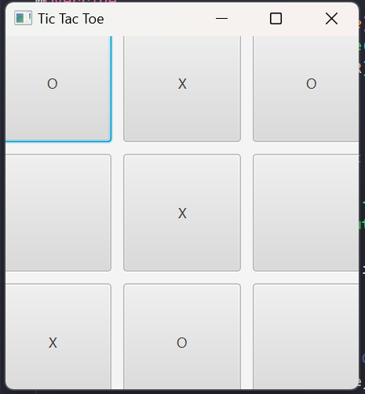

# Tic Tac Toe Game

## Description

Un simple jeu de X/O (Tic Tac Toe) implémenté en Java avec JavaFX pour l'interface graphique et JUnit pour les tests unitaires.

## Comment exécuter le projet

### Prérequis

- Java Development Kit (JDK) installé
- Maven installé

### Instructions

1. Cloner le dépôt git : `git clone https://github.com/AlaaBrahim/TicTacToe-Junit-JavaFX`
2. Naviguer dans le répertoire du projet.
3. Exécuter la commande Maven pour nettoyer et exécuter le projet : `mvn clean javafx:run`

## Commandes utiles

- `mvn test` : Exécute les tests unitaires avec JUnit.
- `mvn clean javafx:run` : Nettoie le projet et lance l'application JavaFX.
